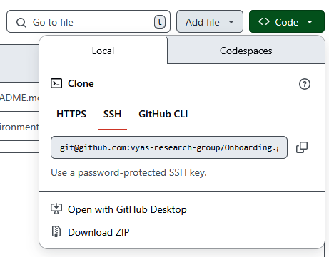

# Onboarding
Instructions to get connected with group resources  

# (0) Quick Setup (Windows Only)

A Setup script exists in the setup scripts folder of this repo. In order to use it, click on the green code button and download this file.

then, in the file explorer, double click on the windows_setup.bat file and it will begin to run. Follow the prompts and the following software will be installed. This Script makes sure you are installing the correct software and saves you from having to click on those links.

- Python
- VSCode
- Git
- WinSCP
- Zotero

This script also sets up the vyasbase conda environment from the environment.yml file provided. It comes with packages that are often used in the Vyas Research Group scripts installed so you may be ready for demos.

> [!Caution]
> This does not set up all of this software so it is ready to use. You will still need to manually go through and add certain plug ins and modify preferences. This just saves you time on some downloads.

# (1) Software to Install  
Most group members use Windows on their personal computers. We have experience setting things up for Linux as well. If you are a Mac user, we'll need to find some work arounds.

### Interacting with the HPC and working with group scripts
- Python: https://docs.anaconda.com/miniconda/install/
- VSCode: https://code.visualstudio.com/
- WinSCP: https://winscp.net/eng/index.php (this is unavailable for Mac)
- Git: https://git-scm.com/downloads/win
- Github: make a github account (https://github.com/)
- Mines HPC Account: You will need to submit a ticket to recieve an HPC account (https://rc.mines.edu/hpc/)
  
### Molecular visualization / structure editors 
For DFT:  
- Avogadro: https://www.openchemistry.org/downloads/ **AND/OR**
- GaussView: requires a license you will obtain from Shubham

For MD:  
- ChimeraX: https://www.cgl.ucsf.edu/chimerax/download.html **AND/OR**
- VMD: https://www.ks.uiuc.edu/Research/vmd/

### For converting filetypes:
- Openbabel: https://openbabel.org/docs/Installation/install.html

### Notes and reference management 
- Zotero: https://www.zotero.org/
- Obsidian: https://obsidian.md/ (optional, makes some tutorials easier)

### Group Drives 
We have two group onedrive accounts, "Vyas Research Group Business" and "VRL Researchers". Ask Shubham to add you to these drives.  
- *Vyas Research Group Business* contains archived group presentations, manuals, tutorials, photos, and the groups meeting schedule among other things.
- *VRL Researchers* contains individual folders for each member of the lab to organize and share file for individual meetings.
  
We also have a group GitHub. This is the place to share code, examples and tutorials of general use to the group.

# (2) Next Steps
### HPC Setup
- Setup WinSCP to connect to the HPC
- Setup VSCode to connect to the HPC (install VSCode extention Remote-SSH and configure properly)
- Setup git account on HPC computer and create initial file structure
- Clone and install group scripts (slurm-scripts, gromacs-scripts) available form github
### Local computer setup
- Setup Python and ensure the path is accessible in VSCode. Create conda environment with base packages (#TODO - make conda environment.yml with base packages)
- Setup git account to connect to group scripts
- work through the [Setup Git](https://github.com/vyas-research-group/Setup_Git) tutorial available on github. You can slo explore git branching [here](https://learngitbranching.js.org/?locale=en_US).

# (3) Technical Starting Points
See the *Vyas Research Group Business* Onedrive. You can find some useful intro papers and reviews on DFT, MD and other tools under *>Tutorials and Examples*.

