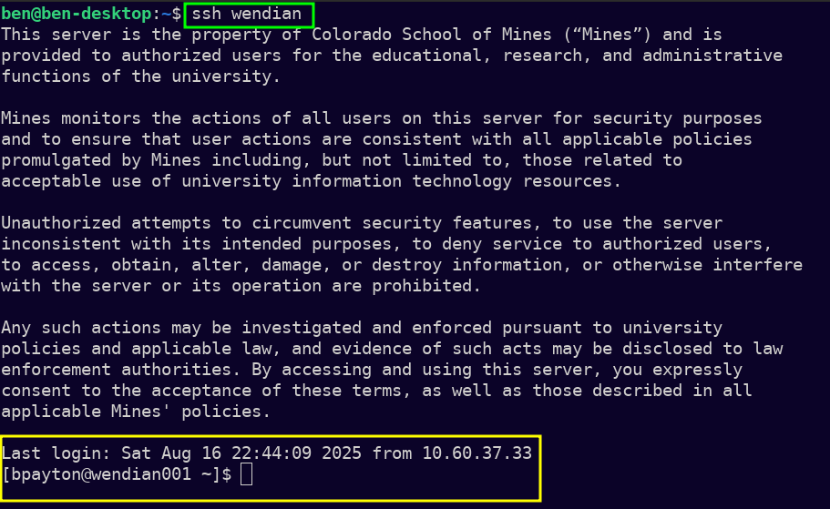

# Disclaimer
The screenshots from this tutorial will be on a linux machine, but ssh is very standardized across all platforms, while small bits may look different on your machine, these instructions should still work. you may just need to adjust the commands you see.

# Why use ssh keys?
ssh is short for "Secure Shell" and is one of the most secure ways for computers to send data back and forth. when logging in to wendian you will likely see something like below:

You have typed `ssh your_username@wendian.mines.edu` and then are prompted to put in your mines password.

Passwords, however are not very secure. Often people use the same password multiple places, or people choose a password that is easy to remember and therefore easy to guess. ssh keys, however are long stings of random charachters that are very difficult to guess. Unfortunately, mines HPC will allways allow for passwords so we won't actually gain any security benefit in this case, instead we will gain convenience. Once yoou follow the instructions here, you will no longer need to enter your mines password when you log in to HPC. Your login will look something like this:

You will get to use a much shorter name when using ssh and wendian will immediately recognize you, no need to enter your password. This also works if you are using the **VScode** ssh plugin.

# How to

## generate an ssh key

1. type the following command in your terminal/command line `ssh-keygen -t ed25519`. this is the command to generate a unique random set of keys.
2. You will then be asked if you would like it to save to the default location. You probably should not. and instead should rename the key by putting in the same path, but a more meaningful name, here I chose demo_key.
3. You will then be asked if you would like to use a passphrase. For the most security you should choose a unique passphrase, for the most convenience, leave this blank.

Then in your home directory in a hidden directory called .ssh you will see your keys. There is a private key and a public key. The public key ends in .pub.

> [!caution]
> It is not a big deal for you to expose or give away your public key, however if you share your private key or it is exposed then anyone who has the key can log in as you (if you dont use a password on the key). You should remove the associated public key from anywhere you need to be secure.

On linux we can use the cat command to see our public key (the file ending in pub). On other platform you can also open the file to see the contents of the public key and copy it to your clipboard.

next in the sssh target computer (wendian in this case) go to the directory `~/.ssh` and create or modify a file called `authorized_keys` and on its own line add the contents of your public key.

back on your client computer in the .ssh directory create or modifty a file called `config` and add the following information. The first `Host` line can be any alias for the ssh target. the `HostName` is the ssh target. `User` is your username. `IdentityFile` is the path to your ssh private key.

You now should no longer need to type your password and the full path to the target when logging in via ssh to your target.